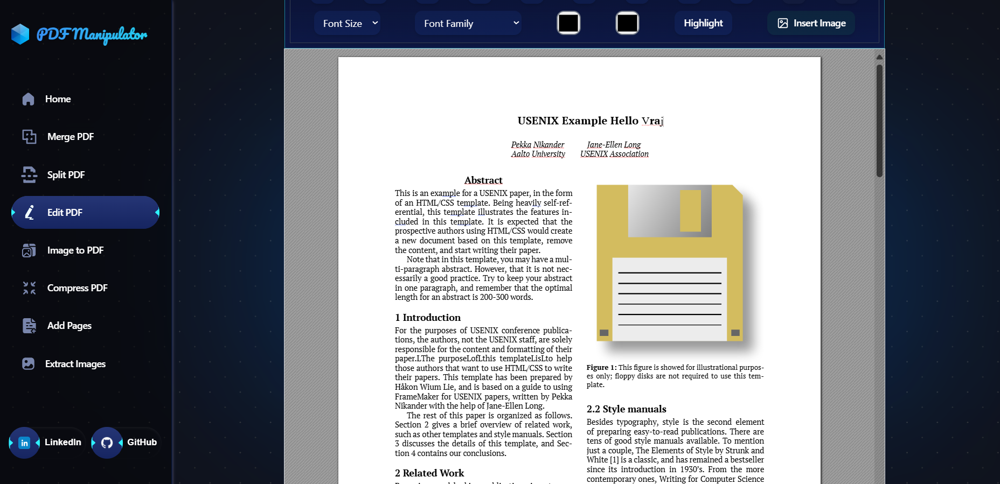
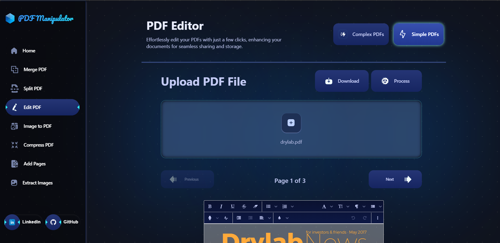
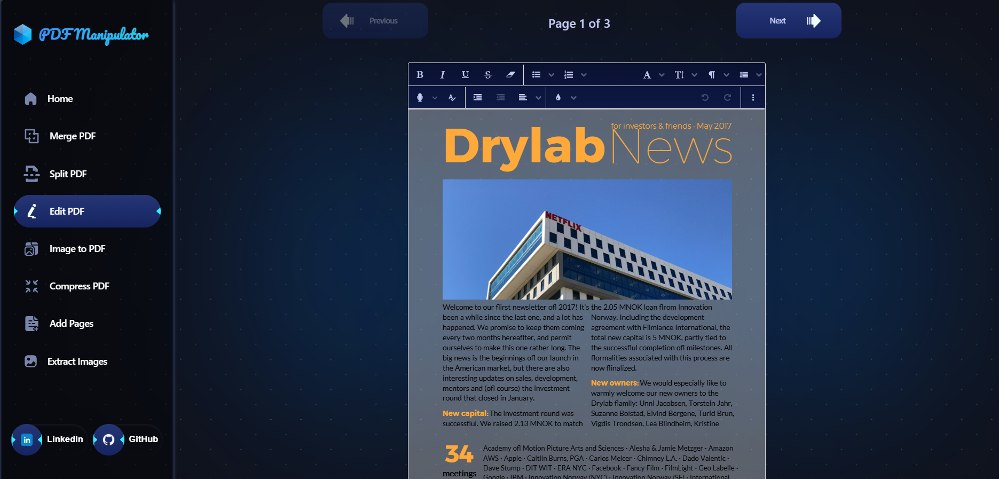
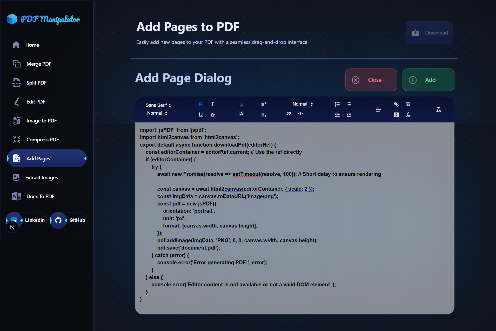
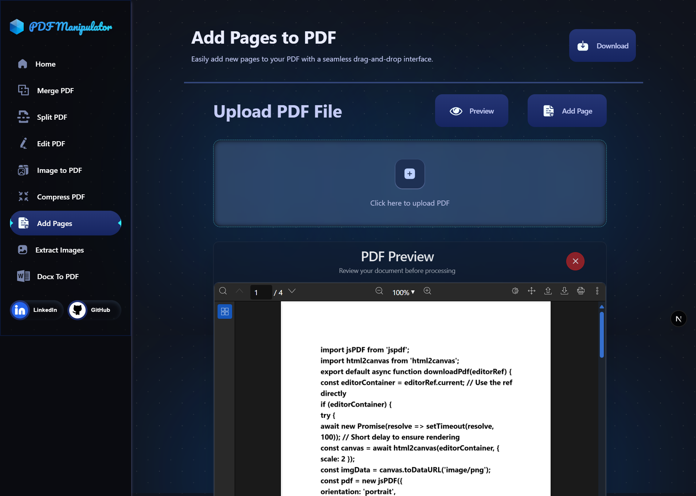
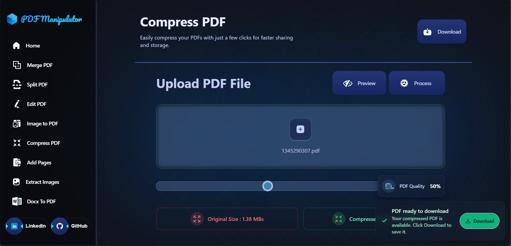

# **PDF Manipulator**

**A feature-rich PDF management tool for seamless editing, merging, splitting, compression, and more!** 


**🚀 Fast Live Demo on Vercel.com:**  [Explore the App](https://pdf-manipulator-vrajvyas11s-projects.vercel.app/)  

**🚀 Contingency Live Demo on ONRender.com:**  [Explore the App](https://next-js-pdf-manipulator.onrender.com/)  

---


## **Overview**

PDF Manipulator is a web-based tool designed for effortless PDF management. From editing to merging, compressing, splitting, and even extracting images from PDF files, this app combines efficiency with simplicity. With its **fully responsive design**, user-friendly drag-and-drop interface, and modern aesthetics, this app caters to the needs of professionals, students, and anyone who frequently works with PDFs.

---

## **Features**

- 🖊️ **Edit PDFs**: Modify content, pages, or annotations seamlessly. Fully responsive for all devices.  
- 📂 **Merge PDFs**: Combine multiple files into a single document effortlessly. Fully responsive for all devices.  
- ✂️ **Split PDFs**: Divide a single PDF into multiple smaller files for better organization. Fully responsive for all devices.  
- 🖼️ **Image to PDF**: Convert images (JPG, PNG, etc.) into high-quality PDFs. Fully responsive for all devices.  
- 📉 **Compress PDFs**: Reduce file size without compromising quality. Fully responsive for all devices.  
- ➕ **Add Pages**: Insert extra pages into existing PDFs easily. Fully responsive for all devices.  
- 📸 **Extract Images**: Save embedded images from PDFs locally. Fully responsive for all devices.  
- 👀 **View PDFs**: Preview and navigate PDFs directly within the app. Fully responsive for all devices.  
- 📤 **Drag-and-Drop**: Upload files with a user-friendly drag-and-drop interface. Fully responsive for all devices.  
- 🔄 **Page Preview**: Rearrange and organize pages before saving changes. Fully responsive for all devices.  

---

## **Tech Stack**

### **Frontend**
- **Next.js**: A powerful framework for building server-side rendered React applications.
- **Tailwind CSS**: A utility-first CSS framework for designing responsive and aesthetically pleasing interfaces for all devices.
- **React**: The core library for building the user interface.
- **React DOM**: For rendering React components in the DOM.

### **PDF Handling**
- **pdf-lib**: To create, modify, and manipulate PDFs.
- **pdfjs-dist**: For parsing and rendering PDF documents.
- **jspdf**: For generating PDFs dynamically in the browser.

### **UI Components**
- **Jodit React**: For integrating a WYSIWYG editor.
- **React Quill**: For rich-text editing functionality.
- **Quill Image Resize Module**: To enable image resizing within the editor.
- **Quill Blot Formatter**: For handling custom formatting in the editor.

---

## **Images**

| **Feature**                       | **Preview**                                                                                 |
|------------------------------------|---------------------------------------------------------------------------------------------|
| 🌐 **Landing Page**                |  - Fully responsive and visually appealing home screen. |
| 📋 **Feature Overview**            |  - Displays all the available tools and features, optimized for all devices.|
| 📂 **Merge PDFs**                  |  - Interface for combining multiple PDF files, fully responsive. |
| ✂️ **Split PDFs**                  |  - Divide a single PDF into multiple smaller files. |
| 🖊️ **PDF Editor (Worker-Based)**   |   - Modify PDFs using a worker-based editor, accessible on all devices. |
| ⚙️ **PDF Editor (Backend-Based)**  |   - Modify PDFs using a backend-powered editor, responsive across devices. |
| 🖼️ **Image to PDF Conversion**     |  - Convert images into high-quality PDF documents, designed to work smoothly on all devices. |
| ➕ **Add Pages to PDFs**            |    - Add extra pages to existing PDFs with ease, responsive UI. |
| 📸 **Extract Images from PDFs**     |  - Extract embedded images from a PDF file, responsive design for mobile and desktop. |
| 📉 **Compress PDFs**               |  - Reduce PDF file size without losing quality, optimized for all devices. |


---

## **Setup and Installation**

Follow these steps to set up and run the project locally:

1. **Clone the Repository**  
   ```bash
   git clone https://github.com/VrajVyas11/PDF-Manipulator.git
   ```

2. **Navigate to the Project Directory**  
   ```bash
   cd PDF-Manipulator
   ```

3. **Install Dependencies**  
   ```bash
   npm install
   ```

4. **Start the Development Server**  
   ```bash
   npm run dev
   ```

5. **Access the App**  
   Open your browser and visit:  
   [http://localhost:3000](http://localhost:3000)

---

## **Contributing**

Contributions are welcome! Follow these steps to contribute:

1. **Fork the Repository**  
   Click the "Fork" button in the top-right corner of the GitHub page.

2. **Clone the Forked Repository**  
   ```bash
   git clone https://github.com/VrajVyas11/PDF-Manipulator.git
   ```

3. **Create a New Branch**  
   ```bash
   git checkout -b feature/your-feature-name
   ```

4. **Make Your Changes**  
   Implement the desired features or fixes.

5. **Push Changes to Your Branch**  
   ```bash
   git push origin feature/your-feature-name
   ```

6. **Submit a Pull Request**  
   Create a pull request from your branch to the `main` branch of the original repository.

---

## **Roadmap**

Planned improvements for future releases:

- **Encrypted PDFs**: Add support for opening and editing password-protected PDFs.
- **Light Mode**: Enhanced UI experience with Light mode support.

---

## License

This project is for learning purposes only and is released under the MIT License. See the [`LICENSE`](./Licence) file for details.

---

## **Acknowledgements**

- [pdf-lib](https://pdf-lib.js.org/) for advanced PDF editing.
- [pdf-dist](https://pdf.js.org/) for handling PDF rendering and processing.
