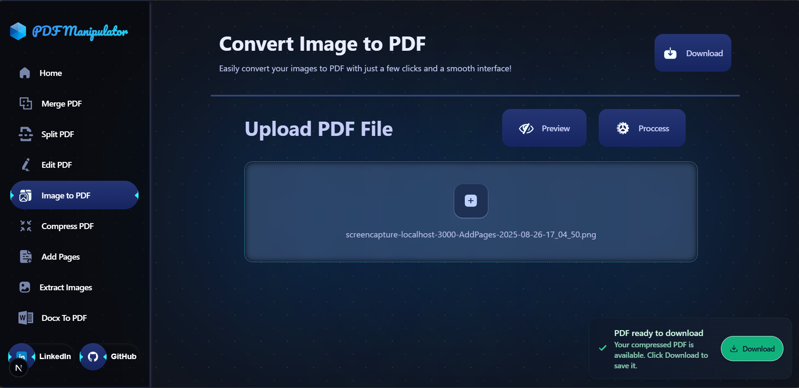
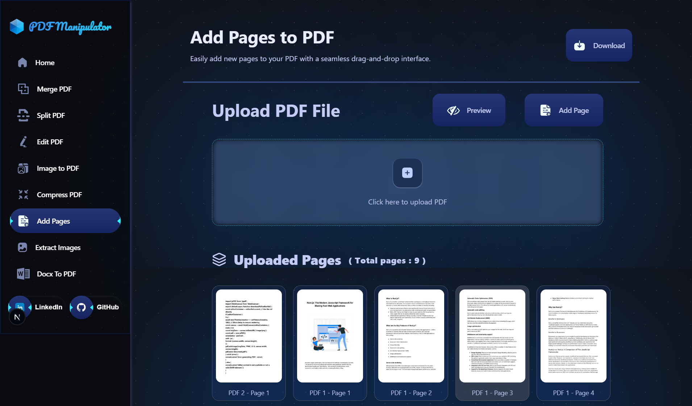

Here’s a README template tailored for your PDF Editor-Merger and Image to PDF Converter project:

---

# PDF Editor-Merger and Image to PDF Converter

**This project is for learning purposes only.**


This project allows users to efficiently edit and merge PDF files, as well as convert images into high-quality PDF documents. Designed with a user-friendly interface, it simplifies document management for both professionals and students.

### Tech Stack:
- **Next.js**
- **Tailwind CSS**

### Features:
- **PDF Editing:** Modify existing PDF content seamlessly.
- **PDF Merging:** Combine multiple PDF files into one.
- **Image to PDF Conversion:** Convert images into PDFs effortlessly.
- **Drag and Drop Interface:** User-friendly drag and drop for file uploads.
- **Page Preview:** View and rearrange pages before merging.


#Images





## Contributing

1. **Fork the Repository:** Click on "Fork" at the top right of this GitHub page.
2. **Clone the Repository:**
   ```bash
   git clone https://github.com/VrajVyas11/Next_JS_PDF_Manipulator.git
   ```
3. **Navigate to the Project Directory:**
   ```bash
   cd Next_JS_PDF_Manipulator
   ```
4. **Install Dependencies:**
   ```bash
   npm install
   ```
5. **Start the Development Server:**
   ```bash
   npm start
   ```

---

Feel free to replace the placeholders, especially the live demo link and GitHub URL, with your actual links. Let me know if you need any adjustments!
